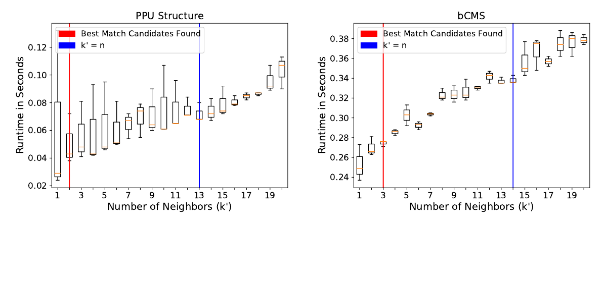
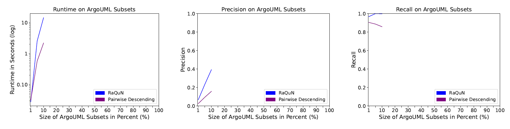

# Installation
Please refer to [REQUIREMENTS.md](REQUIREMENTS.md) for the requirements of the two different setups.

## Installation - Running the Experiments with Docker
The following installation instructions apply, if you plan to run the experiments presented in our paper __with__ Docker.

### Installation Instructions
In the following, we describe how to build the Docker image and run the experiments in Docker containers.

* First, open a suitable terminal.
```
Windows Command Prompt: 
 - Press 'Windows Key + R' on your keyboard
 - Type in 'cmd' 
 - Click 'OK' or press 'Enter' on your keyboard
 
Windows PowerShell:
 - Open the search bar (Default: 'Windows Key') and search for 'PowerShell'
 - Start the PowerShell
 
Linux:
 - Press 'ctrl + alt + T' on your keyboard
```

* Navigate to RaQuN's root directory using the `cd PATH` command
* Build the Docker image with the provided script
```shell
# Windows Command Prompt: 
build-docker-image.bat
 
# Windows PowerShell:
.\build-docker-image.bat
 
# Linux:
./build-docker-image.sh
```

### Other Environments
`build-docker-image` is a convenience script that only provides an additional layer of abstraction for users that are not 
familiar with docker. If your system supports neither `batch` nor `bash`, you can instead execute the following:
```shell
docker build -t match-experiments .
```

The generated Docker image will have the name `match-experiments`.

### Validation of Correct Installation
We prepared an entry point for the Docker image through which you can validate that the image is working. This validation 
comprises a small subset of the experiments which we present in our paper. 

Running the full validation should take around 30 minutes (+- 15 minutes depending on your system). You can start it by 
calling the experiment script:
```shell
# Windows Command Prompt: 
experiment.bat validate
 
# Windows PowerShell:
.\experiment.bat validate
 
# Linux:
./experiment.sh validate
```

If your system supports neither `batch` nor `bash`, you can instead execute the following, providing an absolute path to
the parent directory of where the results are to be stored:
```shell
# Validation
docker run --rm -v PATH_TO_PARENT_DIR/results:/home/user/results match-experiments validate
```

You can cancel the process at any time by opening the RaQuN's root directory in a new terminal window and calling:
```shell
ATTENTION: This will stop the execution of ALL RaQuN docker containers currently running on your system.

# Windows Command Prompt: 
stop-all-experiments.bat
 
# Windows PowerShell:
.\stop-all-experiments.bat
 
# Linux:
./stop-all-experiments.sh
```
Stopping the execution may take a short while.
If your system supports neither `batch` nor `bash`, you can instead execute the following:
```shell
# Stopping all containers
docker container stop $(docker ps -a -q --filter ancestor=match-experiments)
```


### Expected Output
During the execution, the container will print information about each completed experimental run. This output should look 
_similar_ to this:
```
Running RaQuN on ppu_statem...
Dataset: ppu_statem
#1      RaQuN   --      weight: 164.5778        runtimeTotal: 9.57200   k: 0
tp: 10173       fp: 3516        fn: 1404        precision: 0.743151     recall: 0.878725        f-measure: 0.805272
Number of Models 13     --      Number of Elements: 2884
Number of Tuples: 348   --      Number of Elements in Largest Model: 298
Number of Comparisons Theoretically Needed for a Complete N-Way Comparison: 3814644
Number of Comparisons Actually Performed by the Algorithm: 245216
```
At the same time, each run will save its result in an automatically created folder `./results` in the root directory 
of the project. Once the validation run finished, you can find the generated plots and latex tables under `./results/eval-results`.

You can compare the generated plots and tables with the screenshots presented below. Note that they do not show the same
values as presented in our paper, because a large portion of the experimental runs are missing and a different computer 
was used.
#### RQ1 Table

#### RQ2 Plots

#### RQ3 Plots


## Installation - Running the Experiments without Docker
The following installation instructions apply, if you plan to run the experiments presented in our paper __without__ Docker.
```
We encourage you to use Docker though. It is easier to run, more robust, and 
you can also quickly run the experiments with a new setup by rebuilding the Docker image.
```

### Installation Instructions
In the following, we describe how to build the required JAR files and how to prepare the experimental subjects.

* First, make sure that all requirements listed in [REQUIREMENTS.md](REQUIREMENTS.md) are installed
* Open a suitable terminal.
```
Windows Command Prompt: 
 - Press 'Windows Key + R' on your keyboard
 - Type in 'cmd' 
 - Click 'OK' or press 'Enter' on your keyboard
 
Windows PowerShell:
 - Open the search bar (Default: 'Windows Key') and search for 'PowerShell'
 - Start the PowerShell
 
Linux:
 - Press 'ctrl + alt + T' on your keyboard
```
* Navigate to RaQuN's root directory using the `cd PATH` command 
* Make sure that your system is running JDK-11
```shell
java -version
```
* Build RaQuN with Maven
```shell
mvn package
```
* Unpack all zip-files inside the `experimental_subjects` and `experimental_subjects/argouml` directory to
  their current location.
  The resulting file structure should look like this:
```
  ${RaQuN}/
    experimental_subjects/
        argouml/
            argouml_p001_s001.csv
            argouml_p001_s002.csv
            ...
            argouml_p095_s030.csv
        Apogames.csv
        argouml.csv
        bcms.csv
        bcs.csv
        example.csv
        hospitals.csv
        ppu.csv
        ppu_statem.csv
        random.csv
        randomLoose.csv
        randomTight.csv
        warehouses.csv
```

### Validation of Correct Installation
Running the full validation should take around 30 minutes (+- 15 minutes depending on your system). You run it by
calling the experiment JAR files with the corresponding properties:
```shell
# Windows:
java -jar target\RQ1Runner-jar-with-dependencies.jar docker-resources\quick-validation.properties
java -jar target\RQ2Runner-jar-with-dependencies.jar docker-resources\quick-validation.properties
java -jar target\RQ3Runner-jar-with-dependencies.jar docker-resources\quick-validation.properties
# Linux:
java -jar target/RQ1Runner-jar-with-dependencies.jar docker-resources/quick-validation.properties
java -jar target/RQ2Runner-jar-with-dependencies.jar docker-resources/quick-validation.properties
java -jar target/RQ3Runner-jar-with-dependencies.jar docker-resources/quick-validation.properties
```

Lastly, you can run the experiment evaluation that generates plots and tables similar to the ones presented in our paper:
```shell
# Windows:
cd result_analysis_python
python.exe .\evaluation.py
# Linux:
cd result_analysis_python
python3.8 ./evaluation.py
```

### Expected Output
See the section for expected output when running the experiments with Docker.
